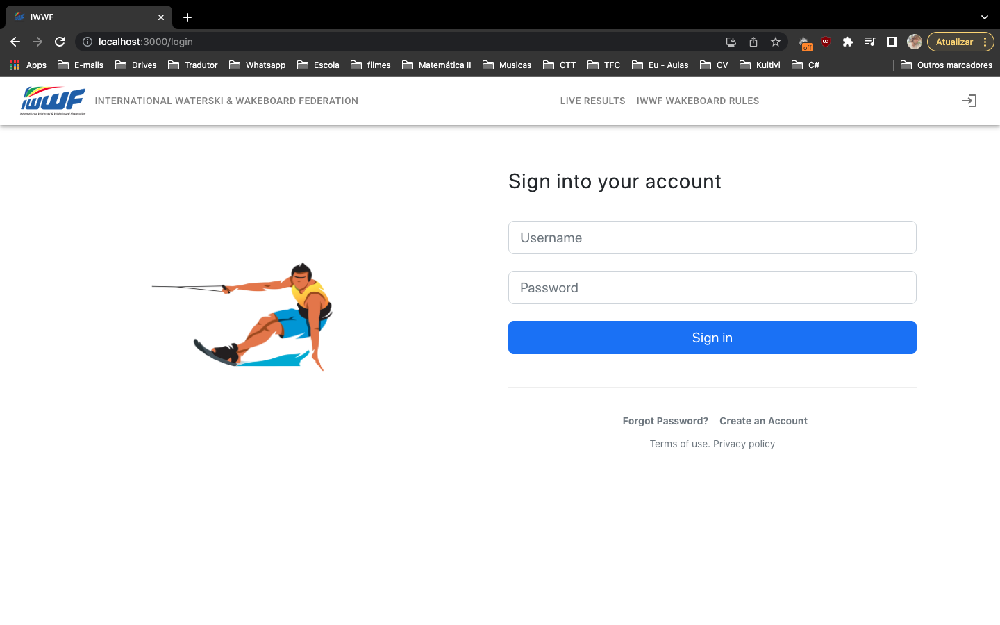
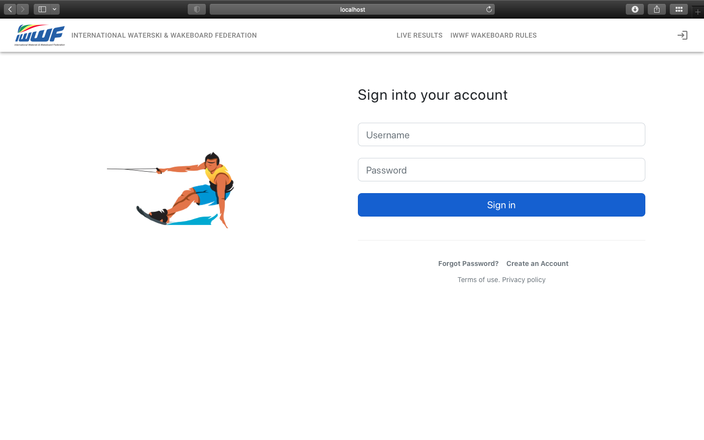
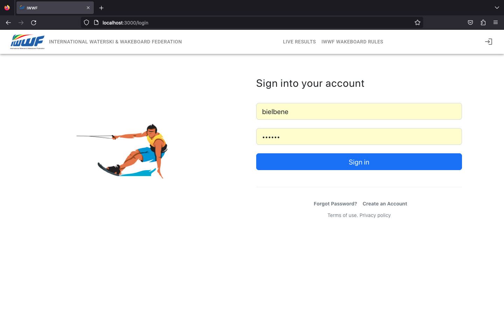
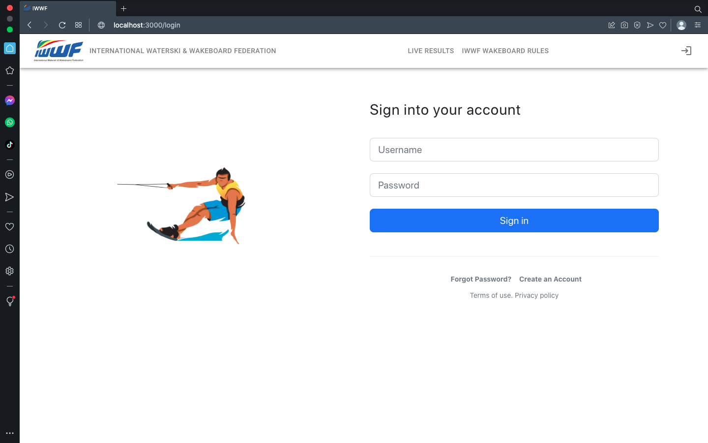

# TFC-DEISI297-GoWake-Frontend

### Alunos

* Joel Bernardino - a21806180
* Gabriel Souza - a21800463

## Passos para instalação

Este projeto é um aplicativo web desenvolvido em React. Para instalá-lo, siga as etapas abaixo:

## Pré-requisitos

* Node.js (v14.17.6 ou superior)
* npm (v6.14.15 ou superior)

## Instalação

1. Faça o clone do repositório: `git clone https://github.com/DEISI-ULHT-TFC-2022-23/TFC-DEISI297-GoWake-Frontend.git`
2. Acesse o diretório do projeto: `cd TFC-DEISI297-GoWake-Frontend`
3. Instale as dependências do projeto: `npm install` e `npm run build` 
4. Inicie o aplicativo: `npm start`
5. O aplicativo será iniciado em `http://localhost:3000/` no seu navegador.

# Funcionalidades

| Pages           | In progress | Done |
|-----------------|-------------|-----|
| Login           |             | X   |
| Create Account  |             | X   |
| Forgot Password | X           |     |
| LiveResults     | X           |     |
| IWWF Rules      |             | X   |
| Dashboard       | X           |     |
| Athletes        | X           |     |
| Upload XML      | X           |     |
| Create Event    | X           |     |
| Modify Event    | X           |     |

# Imagens dos browsers

Aqui estão algumas capturas de tela do aplicativo:

Chrome

Safari

Firefox

Opera

